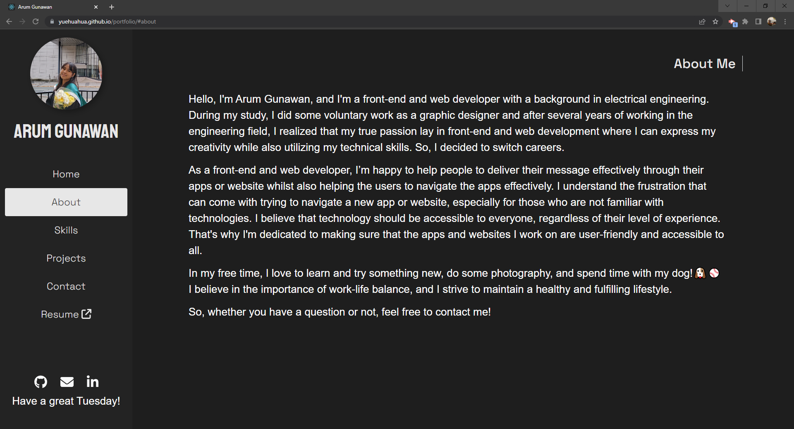
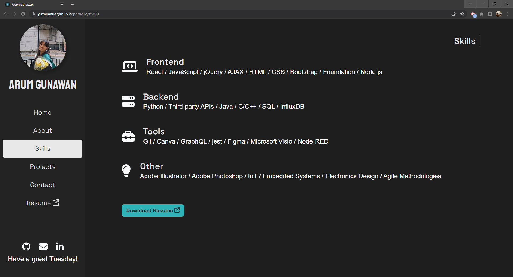
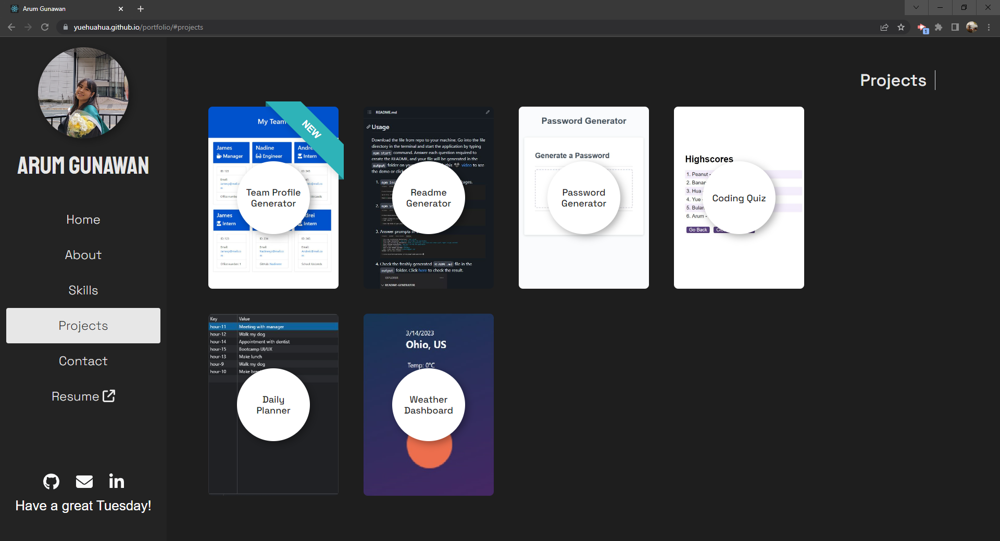
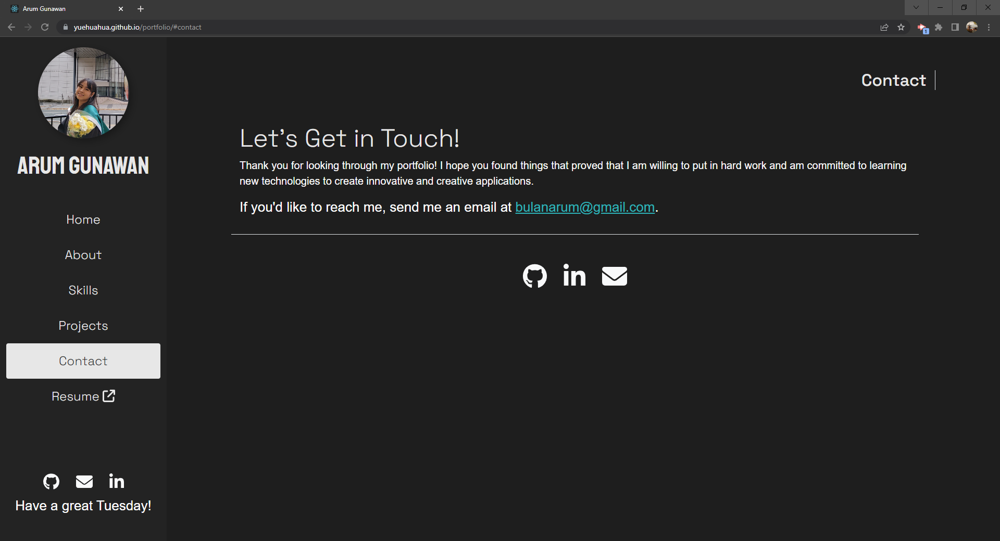
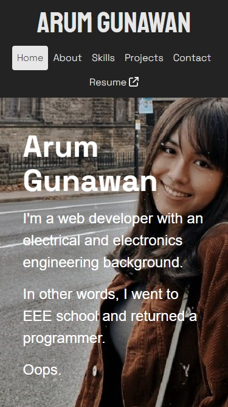
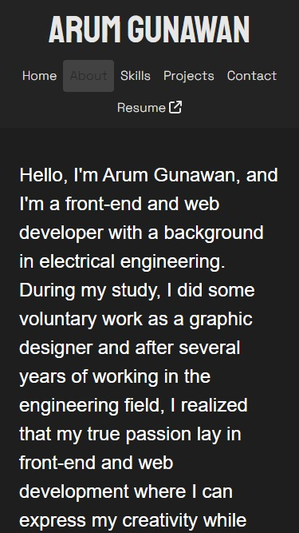
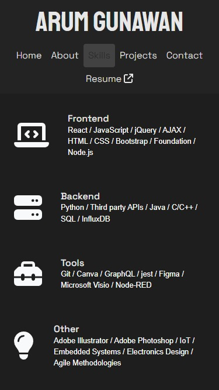
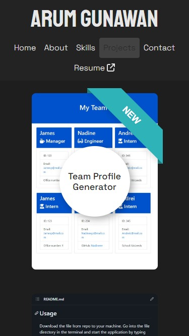
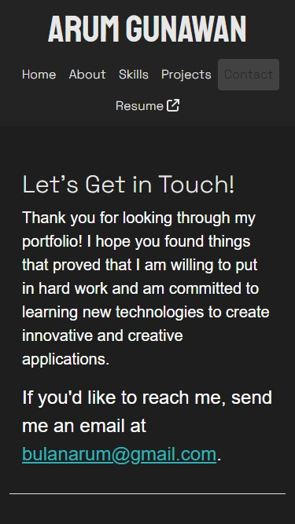

# Arum Gunawan's Portfolio

 

## Table of Contents
* [Description](#description)
* [Tech Used to Build](#tech-used-to-build)
* [Important Links](#important-links)
* [Display](#display)
  * [Desktop View](##desktop-view)
  * [Mobile View](##mobile-view)

 

 

## Description

Hello! I'm a web developer with an electrical engineering background. This application is my digital portofolio that I built with React. Feel free to check my page anytime you want! This readme summarise how my page looks and works. So, please check this readme if you get lost or drop any messages if you have any further questions!

## Tech Used to Build
* ReactJS
* JavaScript
* Bootstrap
* CSS

## Important Links

Portfolio can be accessed at following links:
* [GitHub repository](https://github.com/YueHuaHua/portfolio).
* [Deployed application](https://yuehuahua.github.io/portfolio/).

## Display

I have designed my portfolio to be accessible by any devices. Check the following pictures to see how it looks on both Desktop and Mobile app!

 

### Desktop View

#### Home

#### About

#### Skills

#### Projects

#### Contact

 

### Mobile View

#### Home

#### About

#### Skills

#### Projects

#### Contact

 

## License

Licensed under the [MIT license](https://github.com/git/git-scm.com/blob/main/MIT-LICENSE.txt). See LICENSE for the full details.
